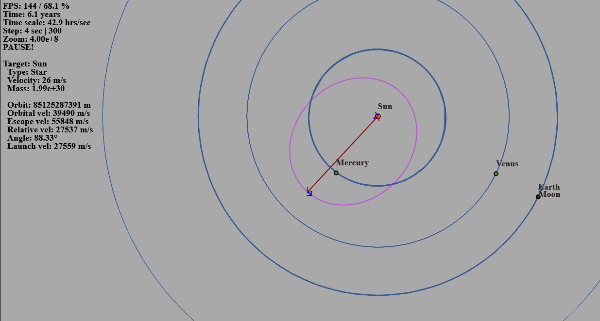

# MCosmos

MCosmos is an interactive 2D space simulation platform. It visualizes planetary systems, allowing you to observe and experiment with gravitational interactions, launch new bodies, and explore orbital mechanics.

It's my little pet project to learn some JS.

Just launch index.html in your browser to play.

## Controls

### Mouse
- **Left Mouse Drag**: Pan the camera view.
- **Mouse Wheel**: Zoom in/out.
- **Left Click**: Select a body under the cursor.
- **Shift + Left Click**: Start launching a new body from the clicked position. Drag to set direction and velocity, release to launch.

### Keyboard
- **S**: Start/Pause the simulation.
- **Arrow Left/Right**: Select previous/next body. Camera centers on selected body.
- **Arrow Up/Down**: Increase/decrease time scale (simulation speed).
- **G**: Toggle gravity field visualization.
- **T**: Toggle orbital track visualization.
- **Y**: Toggle relative track visualization (tracks relative to selected body).
- **Delete**: Remove selected body (or cancel launch if launching).
- **Space (hold)**: Camera follows the selected body.
- **Shift (hold)**: Enables launch mode with mouse.
- **Number Keys (1-3)**:
  - **1**: Spawn a single photon at mouse position.
  - **2**: Spawn a circle of photons at mouse position.
  - **3**: Spawn a line of photons at mouse position.
  - **4**: Spawn a black hole with mass of 1000 suns at mouse position.
- **P**: Remove all photons (light particles) from the simulation.
---